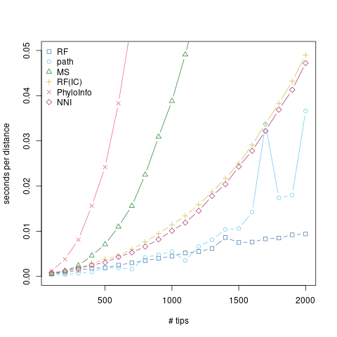

The Robinson-Foulds (RF) distance has haters.
That may seem a strange thing to say about a phylogenetic distance metric, but it is nonetheless true.
While there are reasons the RF distance is not ideal, I think there's a lot to like about it, and I find myself continuing to use it for one reason or another despite the myriad alternatives in existence.


## What is the RF distance?
For two trees, it measures distance by the number of [splits](https://afmagee.github.io/an-interpretable-split-summary/) which are found in only one of the trees.
Equivalently, it's the total number of splits in both trees combined, minus twice the count of the splits which are seen in both trees.


## Why don't some people like it?

It's an easy target.
Okay, I'm being a bit facetious.
But I do think it endures some criticism simply by dint of being a well-established, commonly-employed[^1] measure of phylogenetic distance.

Less facetiously:
- It's a coarse distance.
It can only take on $2 (n - 3)$ values, since it can only say whether a split is present or not.
- It saturates relatively quickly. Compared to other distances, it maxes out relatively quickly.
- Other distances appear to [more faithfully capture treespace](https://academic.oup.com/sysbio/article/71/5/1255/6486431).
- Some find it uninterpretable.

## Why do I like it?
- I think it's intuitive. Splits are a very common way to think about trees and tree sets, so why not compare trees based on their splits?
- I think it's interpretable.[^2] Bigger distances mean more splits are different between trees, smaller distances mean they share more. And I can understand what a split is.
- It works for rooted and unrooted trees and makes an equal amount of sense for both.
- It's widely implemented and readily implementable.
- It's incredibly fast and scalable to compute compared to pretty much every other phylogenetic distance metric out there.

## Pedal to the metal
I'll be the first to admit that claims of speed and scalability are often overblown.
As an impatient person, I certainly _like_ it when my analysis is fast, but I don't always _need_ it to be fast.
And there is a strong degree of "because it's there" in big-data fever.

But there are times that speed and scalability matter.
Tree to tree distances drive many of the ways we think about and visualize distributions of trees.
They underlie the whole-tree-based approach to understanding the convergence and mixing of phylogenetic MCMC.
Posterior distributions on trees, even heavily thinned, get big fast, so we're talking about comparing many trees.
And while we may not need a million tips in our tree, hundreds or thousands of tips should not be too big of an ask.

And the thing is, most distance metrics don't scale well with tree size.
The path distance, which is also commonly-encountered, encodes the tree as a vector of all $\mathcal{O}(n^2)$ tip to tip distances.
Thoughtful modifications to the RF distance require us not just to check for the presence of splits but to compare them, requiring figuring out which ones to match with which others.
If you have a lot of even sort-of-big trees, in other words, your distance based options get limited fast.

[Smith (2020)](https://academic.oup.com/bioinformatics/article/36/20/5007/5866976?login=false) considered a number of tree distances, and kindly summarized runtimes for them at 20 and 50 tips in Table 1.
From this, we can see that there's a great deal of variation in speed and in scaling.
I took the fastest and most promising of these (in terms of scaling) and fleshed things out a little more.



The R code is below, but it's more or less just taking random trees at increasing sizes to better look at scaling.
Random trees are definitely a mean[^3] test case, but I think the point stands.
The RF distance scales really, really, really well with tree size.
Even the more promising alternatives just can't keep up, and compare poorly to the already quadratic path distance.

## Appendix: R code

```
library(ape)
library(phangorn)
library(TreeDist)

# https://personal.sron.nl/~pault/
tol_bright_colors <- c("#4477AA", "#66CCEE", "#228833", "#CCBB44", "#EE6677", "#AA3377", "BBBBBB")

ntips <- 100 * (1:20)
ntrees <- 5

set.seed(42)
treesets <- lapply(ntips, function(n){
  rmtree(ntrees, n, FALSE)
})

timeit <- function(dfun) {
  sapply(treesets, function(trees){
    system.time(dfun(trees))[1] / choose(length(trees), 2)
  })
}

rf_times <- timeit(phangorn::RF.dist)
pd_times <- timeit(phangorn::path.dist)
ms_times <- timeit(TreeDist::MatchingSplitDistance)
rfic_times <- timeit(TreeDist::InfoRobinsonFoulds)
pi_times <- timeit(TreeDist::PhylogeneticInfoDistance)
nni_times <- timeit(TreeDist::NNIDist)


all_times <- cbind(
  rf_times,
  pd_times,
  ms_times,
  rfic_times,
  pi_times,
  nni_times
)

dnames <- c("RF", "path", "MS", "RF(IC)", "PhyloInfo", "NNI")
dpch <- 0:5
dcols <- tol_bright_colors[1:6]

matplot(ntips, all_times, type = "b", lty=1, pch = dpch, col = dcols, xlab = "# tips", ylab = "seconds per distance")
legend("topleft", legend = dnames, col = dcols, pch = dpch, border = NA, bty = "n")

```

[^1]: [Robinson and Foulds (1981)](https://www.sciencedirect.com/science/article/abs/pii/0025556481900432) has almost 3000 citations.
[^2]: Clearly, interpretability is in the eye of the beholder. See also: the entirety of information theory.
[^3]: As in cruel, not as in average.